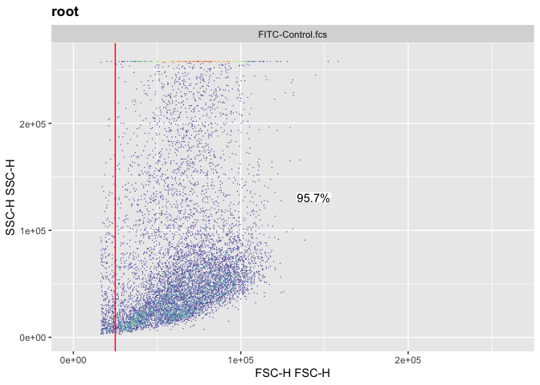

Manual Gating
================
Hanne Grosemans

TO USE IF YOU DON’T WANT TO USE AUTOMATIC GATING FOR nonDEBRIS AND
SINGLETS

# Load packages

``` r
#source("http://www.bioconductor.org/biocLite.R")
#biocLite("BiocUpgrade")
library(tidyverse)
```

    ## ── Attaching packages ─────────────────────────────────────────────────────────────────────── tidyverse 1.2.1 ──

    ## ✔ ggplot2 3.2.1     ✔ purrr   0.3.2
    ## ✔ tibble  2.1.3     ✔ dplyr   0.8.3
    ## ✔ tidyr   0.8.3     ✔ stringr 1.4.0
    ## ✔ readr   1.3.1     ✔ forcats 0.4.0

    ## ── Conflicts ────────────────────────────────────────────────────────────────────────── tidyverse_conflicts() ──
    ## ✖ dplyr::filter() masks stats::filter()
    ## ✖ dplyr::lag()    masks stats::lag()

``` r
library(openCyto)
```

    ## Loading required package: flowWorkspace

    ## Loading required package: flowCore

    ## 
    ## Attaching package: 'flowCore'

    ## The following object is masked from 'package:tibble':
    ## 
    ##     view

    ## Loading required package: ncdfFlow

    ## Loading required package: RcppArmadillo

    ## Loading required package: BH

    ## Registered S3 method overwritten by 'R.oo':
    ##   method        from       
    ##   throw.default R.methodsS3

``` r
library(flowViz)
```

    ## Loading required package: lattice

    ## 
    ## Attaching package: 'lattice'

    ## The following objects are masked from 'package:ncdfFlow':
    ## 
    ##     densityplot, histogram, xyplot

``` r
library(flowUtils)
library(flowDensity)
```

    ## Warning: replacing previous import 'flowCore::plot' by 'graphics::plot'
    ## when loading 'flowDensity'

``` r
library(ggplot2)
library(dplyr)
library(ggcyto)
library(flowWorkspace)
```

\#Load fcs file

``` r
fcsFile <- list.files(path = "FCS/", pattern = ".fcs")
fs <- read.flowSet(fcsFile, path = "FCS/")
fcsFile <- read.FCS("FCS/WT.fcs")
```

\#Explore data

``` r
fcsFile
```

    ## flowFrame object 'WT.fcs'
    ## with 50000 cells and 34 observables:
    ##                      name                       desc  range   minRange
    ## $P1                  Time                       <NA> 262144    0.00000
    ## $P2                 FSC-A                      FSC-A 262144    0.00000
    ## $P3                 FSC-H                      FSC-H 262144    0.00000
    ## $P4                 FSC-W                      FSC-W 262144    0.00000
    ## $P5       YellowGreen_D-A            YellowGreen_D-A 262144  -38.06389
    ## $P6       YellowGreen_D-H            YellowGreen_D-H 262144    0.00000
    ## $P7       YellowGreen_D-W            YellowGreen_D-W 262144    0.00000
    ## $P8       PE-CF594 (YG)-A CD142 (F3) PE-CF594 (YG)-A 262144 -111.00000
    ## $P9       PE-CF594 (YG)-H CD142 (F3) PE-CF594 (YG)-H 262144    0.00000
    ## $P10      PE-CF594 (YG)-W CD142 (F3) PE-CF594 (YG)-W 262144    0.00000
    ## $P11      YellowGreen_B-A            YellowGreen_B-A 262144 -111.00000
    ## $P12      YellowGreen_B-H            YellowGreen_B-H 262144    0.00000
    ## $P13      YellowGreen_B-W            YellowGreen_B-W 262144    0.00000
    ## $P14      YellowGreen_A-A            YellowGreen_A-A 262144  -42.73840
    ## $P15      YellowGreen_A-H            YellowGreen_A-H 262144    0.00000
    ## $P16      YellowGreen_A-W            YellowGreen_A-W 262144    0.00000
    ## $P17             SB436*-A              SCA1 SB436*-A 262144 -106.91323
    ## $P18             SB436*-H              SCA1 SB436*-H 262144    0.00000
    ## $P19             SB436*-W              SCA1 SB436*-W 262144    0.00000
    ## $P20           Violet_A-A                 Violet_A-A 262144 -111.00000
    ## $P21           Violet_A-H                 Violet_A-H 262144    0.00000
    ## $P22           Violet_A-W                 Violet_A-W 262144    0.00000
    ## $P23                SSC-A                      SSC-A 262144    0.00000
    ## $P24                SSC-H                      SSC-H 262144    0.00000
    ## $P25                SSC-W                      SSC-W 262144    0.00000
    ## $P26               FITC-A           LIN Sytox FITC-A 262144 -111.00000
    ## $P27               FITC-H           LIN Sytox FITC-H 262144    0.00000
    ## $P28               FITC-W           LIN Sytox FITC-W 262144    0.00000
    ## $P29             Blue_A-A                   Blue_A-A 262144 -111.00000
    ## $P30             Blue_A-H                   Blue_A-H 262144    0.00000
    ## $P31             Blue_A-W                   Blue_A-W 262144    0.00000
    ## $P32            IndexSort                       <NA> 262144    0.00000
    ## $P33            DeltaTime                       <NA> 262144    0.00000
    ## $P34 RegionClassification                       <NA> 262144    0.00000
    ##      maxRange
    ## $P1    262143
    ## $P2    262143
    ## $P3    262143
    ## $P4    262143
    ## $P5    262143
    ## $P6    262143
    ## $P7    262143
    ## $P8    262143
    ## $P9    262143
    ## $P10   262143
    ## $P11   262143
    ## $P12   262143
    ## $P13   262143
    ## $P14   262143
    ## $P15   262143
    ## $P16   262143
    ## $P17   262143
    ## $P18   262143
    ## $P19   262143
    ## $P20   262143
    ## $P21   262143
    ## $P22   262143
    ## $P23   262143
    ## $P24   262143
    ## $P25   262143
    ## $P26   262143
    ## $P27   262143
    ## $P28   262143
    ## $P29   262143
    ## $P30   262143
    ## $P31   262143
    ## $P32   262143
    ## $P33   262143
    ## $P34   262143
    ## 650 keywords are stored in the 'description' slot

``` r
exprs(fcsFile)[1:10,]
```

    ##        Time     FSC-A  FSC-H    FSC-W YellowGreen_D-A YellowGreen_D-H
    ##  [1,] 65560  73248.23  66388 72308.18        52.08743              68
    ##  [2,] 65563  81118.24  73605 72225.61        83.47344             101
    ##  [3,] 65566  93843.24  81072 75859.87       206.34636             144
    ##  [4,] 65567 156827.69 106980 96072.72      1891.17432            1152
    ##  [5,] 65571  91272.77  79860 74901.74       286.48087             292
    ##  [6,] 65572  22784.01  29657 50348.08        54.75858             121
    ##  [7,] 65573  45077.27  51700 57140.89        40.73504              68
    ##  [8,] 65574  38232.46  48609 51546.06        16.69469              37
    ##  [9,] 65575 174569.39 128721 88878.89        96.16141              97
    ## [10,] 65575  60061.82  63078 62402.29       182.30600             198
    ##       YellowGreen_D-W PE-CF594 (YG)-A PE-CF594 (YG)-H PE-CF594 (YG)-W
    ##  [1,]        50200.03       124.20848             288        28264.33
    ##  [2,]        54163.52       453.42773             529        56173.61
    ##  [3,]        93910.52      1065.12109             884        78963.55
    ##  [4,]       107586.80      9799.78223            6128       104803.94
    ##  [5,]        64297.30      1405.02502             976        94343.98
    ##  [6,]        29658.33       347.91733             509        44795.89
    ##  [7,]        39258.99       267.11502             464        37727.70
    ##  [8,]        29570.35        70.78548             181        25629.82
    ##  [9,]        64969.42       538.90454             549        64330.88
    ## [10,]        60341.45      1123.21863            1170        62915.60
    ##       YellowGreen_B-A YellowGreen_B-H YellowGreen_B-W YellowGreen_A-A
    ##  [1,]      -14.691326              38           0.000       30.050440
    ##  [2,]       56.761940              64       58124.227       94.825836
    ##  [3,]       79.466721             120       43399.426       30.050440
    ##  [4,]      473.461365             306      101401.195      212.356445
    ##  [5,]      114.191673             148       50565.305       61.436455
    ##  [6,]       22.704777              59       25220.004       18.030264
    ##  [7,]       11.352388              31       23999.682       12.020176
    ##  [8,]        6.677876              45        9725.361        4.674513
    ##  [9,]       38.731678              58       43764.125       12.020176
    ## [10,]       72.121056             124       38117.141        8.013451
    ##       YellowGreen_A-H YellowGreen_A-W    SB436*-A SB436*-H  SB436*-W
    ##  [1,]              66       29839.178    47.07373       50  61700.48
    ##  [2,]             112       55486.660   145.21051      132  72094.82
    ##  [3,]              76       25912.971  5415.87305     2940 120726.06
    ##  [4,]             210       66271.391 18330.83203     8150 147402.38
    ##  [5,]              64       62910.930   182.70992      160  74837.98
    ##  [6,]              47       25141.094  2530.81152     2591  64013.61
    ##  [7,]              47       16760.730  3493.03076     2459  93094.45
    ##  [8,]              45        6807.753    11.96790       41  19129.96
    ##  [9,]              46       17125.092   160.36984      126  83412.69
    ## [10,]              40       13129.237  1377.10620     1080  83564.84
    ##       Violet_A-A Violet_A-H Violet_A-W      SSC-A  SSC-H    SSC-W
    ##  [1,]   230.5815        182   83029.62  17580.359  15158 76009.13
    ##  [2,]  1443.3286       1012   93468.36 236985.156 210447 73800.34
    ##  [3,]  5213.2168       2808  121671.43  42554.961  34266 81389.19
    ##  [4,] 15389.9199       6886  146470.20  84185.953  57786 95476.59
    ##  [5,]  2344.1123       1780   86305.48 119029.742 110182 70798.61
    ##  [6,]  2245.1777       2363   62268.29  14038.583  17942 51278.15
    ##  [7,]  3035.8569       2235   89019.21  19821.965  20998 61865.53
    ##  [8,]   411.6957        537   50243.74   8782.381  11199 51394.06
    ##  [9,]  1876.5665       1418   86729.66  62098.676  55731 73023.98
    ## [10,]  1568.5925       1388   74062.89  26110.691  25612 66812.05
    ##            FITC-A FITC-H    FITC-W  Blue_A-A Blue_A-H Blue_A-W
    ##  [1,]    50.53441     64  51747.23  64.88368      176 24160.32
    ##  [2,]   522.81274    473  72437.75 429.85440      553 50942.02
    ##  [3,] 10396.98633   5804 117397.81 709.35333      524 88717.91
    ##  [4,]   786.71466    552  93402.41 569.60388      540 69128.81
    ##  [5,]   535.91425    528  66518.33 521.56500      544 62833.24
    ##  [6,]   114.79421    148  50832.12  20.58809       64 21082.21
    ##  [7,]  2468.07544   2208  73255.34 187.16447      288 42590.32
    ##  [8,]  4163.78564   4701  58046.77 235.20335      457 33729.29
    ##  [9,]   588.94421    421  91679.45 358.73190      709 33159.17
    ## [10,]   121.03303    138  57478.41 227.71678      282 52920.73
    ##          IndexSort DeltaTime RegionClassification
    ##  [1,] 3.433181e-43     14860         3.433181e-43
    ##  [2,] 3.447194e-43     34917         3.447194e-43
    ##  [3,] 3.461207e-43     22024         3.461207e-43
    ##  [4,] 3.475220e-43     16769         3.475220e-43
    ##  [5,] 3.489233e-43     39784         3.489233e-43
    ##  [6,] 3.503246e-43     10731         3.503246e-43
    ##  [7,] 3.517259e-43     11606         3.517259e-43
    ##  [8,] 3.531272e-43      4878         3.531272e-43
    ##  [9,] 3.545285e-43      9499         3.545285e-43
    ## [10,] 3.559298e-43      4788         3.559298e-43

``` r
summary(fcsFile)
```

    ##              Time     FSC-A     FSC-H     FSC-W YellowGreen_D-A
    ## Min.     65560.00  10491.68  16385.00  41275.07       -38.06389
    ## 1st Qu.  91217.75  40716.46  47699.75  54529.40        34.72495
    ## Median  105479.00  64927.12  64394.00  63797.59        93.49026
    ## Mean    105433.80  80032.53  65176.82  75278.46       399.52412
    ## 3rd Qu. 130450.00 100935.00  83249.75  80094.26       219.03432
    ## Max.    134614.00 262143.00 157182.00 262143.00     40034.53125
    ##         YellowGreen_D-H YellowGreen_D-W PE-CF594 (YG)-A PE-CF594 (YG)-H
    ## Min.             0.0000            0.00       -303.1755           0.000
    ## 1st Qu.         61.0000        36300.48        189.6517         308.000
    ## Median         109.0000        53865.33        545.5825         592.000
    ## Mean           326.0931        56931.04       2103.5276        1691.087
    ## 3rd Qu.        199.0000        70335.20       1236.9095        1097.000
    ## Max.         18252.0000       262143.00     202922.6094       93018.000
    ##         PE-CF594 (YG)-W YellowGreen_B-A YellowGreen_B-H YellowGreen_B-W
    ## Min.               0.00      -298.50104          0.0000            0.00
    ## 1st Qu.        39793.74        20.03363         51.0000        26258.48
    ## Median         56681.50        58.09752         79.0000        47265.26
    ## Mean           59809.87       144.25967        130.0085        50372.73
    ## 3rd Qu.        72547.70       123.54070        124.0000        66074.11
    ## Max.          262143.00     30012.37500       3866.0000       262143.00
    ##         YellowGreen_A-A YellowGreen_A-H YellowGreen_A-W     SB436*-A
    ## Min.          -42.73840          0.0000            0.00   -106.91323
    ## 1st Qu.        14.69133         56.0000        15977.38     50.26517
    ## Median         43.40619         88.0000        31764.29    161.96556
    ## Mean           93.89599        117.6865        35545.20   2552.95226
    ## 3rd Qu.        94.15804        136.0000        48243.92   1572.78137
    ## Max.        33482.86719       3474.0000       262143.00 262143.00000
    ##           SB436*-H  SB436*-W  Violet_A-A Violet_A-H Violet_A-W
    ## Min.         0.000      0.00   -374.9942      1.000       0.00
    ## 1st Qu.     57.000  55487.38    828.9764    718.000   63868.26
    ## Median     121.000  77066.57   1794.3870   1394.000   78687.79
    ## Mean      1491.243  82917.51   4221.4875   2619.989   90851.86
    ## 3rd Qu.   1099.250 102165.34   4329.1880   2941.000  102654.50
    ## Max.    258896.000 262143.00 262143.0000 258256.000  262143.00
    ##                SSC-A     SSC-H     SSC-W      FITC-A    FITC-H    FITC-W
    ## Min.        18.09257      6.00  38656.43  -1033.7717      0.00      0.00
    ## 1st Qu.  18163.06445  20342.00  55613.73    378.6961    346.00  54595.46
    ## Median   44083.78320  42840.00  64319.55   2775.3372   2502.50  61923.80
    ## Mean     73505.91199  66893.04  67827.44  25105.1255  25834.88  68732.60
    ## 3rd Qu.  87668.61719  74835.50  72495.57  23922.2710  23355.50  73858.70
    ## Max.    262143.00000 257711.00 262143.00 262143.0000 258685.00 262143.00
    ##            Blue_A-A   Blue_A-H  Blue_A-W    IndexSort  DeltaTime
    ## Min.      -113.5464      0.000      0.00 3.138909e-43     34.000
    ## 1st Qu.    297.5915    404.000  43712.00 3.236999e-43   1318.000
    ## Median     586.4487    670.000  52687.47 3.349103e-43   3693.000
    ## Mean      4623.6101   4641.691  56405.74 3.355948e-43   6137.882
    ## 3rd Qu.   2738.2163   2515.250  63267.57 3.461207e-43   8164.250
    ## Max.    262143.0000 258047.000 262143.00 3.573311e-43 262144.000
    ##         RegionClassification
    ## Min.            0.000000e+00
    ## 1st Qu.         3.265025e-43
    ## Median          3.405155e-43
    ## Mean            5.732300e+00
    ## 3rd Qu.         3.545285e-43
    ## Max.            6.200000e+01

``` r
str(keyword(fcsFile))
```

    ## List of 650
    ##  $ FCSversion                   : chr "3.1"
    ##  $ $PAR                         : chr "34"
    ##  $ $DATATYPE                    : chr "F"
    ##  $ $MODE                        : chr "L"
    ##  $ $BYTEORD                     : chr "1,2,3,4"
    ##  $ $TOT                         : chr "50000"
    ##  $ $BEGINDATA                   : chr "               12411"
    ##  $ $ENDDATA                     : chr "             6812410"
    ##  $ $BEGINSTEXT                  : chr "0"
    ##  $ $ENDSTEXT                    : chr "0"
    ##  $ $BEGINANALYSIS               : chr "0"
    ##  $ $ENDANALYSIS                 : chr "0"
    ##  $ $NEXTDATA                    : chr "0"
    ##  $ $TIMESTEP                    : chr "0.01"
    ##  $ $DATE                        : chr "16-JUL-2018"
    ##  $ $BTIM                        : chr "14:23:38.72"
    ##  $ $ETIM                        : chr "14:24:48.23"
    ##  $ EXPORT TIME                  : chr "16-JUL-2018 16:32:39.32"
    ##  $ $P1N                         : chr "Time"
    ##  $ $P1B                         : chr "32"
    ##  $ $P1E                         : chr "0,0"
    ##  $ $P1R                         : chr "262144"
    ##  $ P1KIND                       : chr "Time"
    ##  $ $P2N                         : chr "FSC-A"
    ##  $ $P2B                         : chr "32"
    ##  $ $P2E                         : chr "0,0"
    ##  $ $P2R                         : chr "262144"
    ##  $ $P2V                         : chr "95"
    ##  $ $P2S                         : chr "FSC-A"
    ##  $ P2MEAS                       : chr "A"
    ##  $ P2THRESHOLD                  : chr "16358"
    ##  $ P2MS                         : chr "1000"
    ##  $ P2KIND                       : chr "SCATTER"
    ##  $ P2TARGETVALUE                : chr "0.0790596211908806"
    ##  $ P2FLUOR                      : chr "FSC"
    ##  $ P2DET                        : chr "FSC"
    ##  $ $P2L                         : chr "488"
    ##  $ FL2ABD                       : chr "99945"
    ##  $ FL2SLOPE                     : chr "0.00386796775273979"
    ##  $ FL2INTERCEPT                 : chr "3.53559565544128"
    ##  $ $P3N                         : chr "FSC-H"
    ##  $ $P3B                         : chr "32"
    ##  $ $P3E                         : chr "0,0"
    ##  $ $P3R                         : chr "262144"
    ##  $ $P3V                         : chr "95"
    ##  $ $P3S                         : chr "FSC-H"
    ##  $ P3MEAS                       : chr "H"
    ##  $ P3THRESHOLD                  : chr "16358"
    ##  $ P3MS                         : chr "1000"
    ##  $ P3KIND                       : chr "SCATTER"
    ##  $ P3TARGETVALUE                : chr "0.0790596211908806"
    ##  $ P3FLUOR                      : chr "FSC"
    ##  $ P3DET                        : chr "FSC"
    ##  $ $P3L                         : chr "488"
    ##  $ FL3ABD                       : chr "99945"
    ##  $ FL3SLOPE                     : chr "0.00386796775273979"
    ##  $ FL3INTERCEPT                 : chr "3.53559565544128"
    ##  $ $P4N                         : chr "FSC-W"
    ##  $ $P4B                         : chr "32"
    ##  $ $P4E                         : chr "0,0"
    ##  $ $P4R                         : chr "262144"
    ##  $ $P4V                         : chr "95"
    ##  $ $P4S                         : chr "FSC-W"
    ##  $ P4MEAS                       : chr "W"
    ##  $ P4THRESHOLD                  : chr "16358"
    ##  $ P4KIND                       : chr "SCATTER"
    ##  $ P4TARGETVALUE                : chr "0.0790596211908806"
    ##  $ P4FLUOR                      : chr "FSC"
    ##  $ P4DET                        : chr "FSC"
    ##  $ $P4L                         : chr "488"
    ##  $ FL4ABD                       : chr "99945"
    ##  $ FL4SLOPE                     : chr "0.00386796775273979"
    ##  $ FL4INTERCEPT                 : chr "3.53559565544128"
    ##  $ $P5N                         : chr "YellowGreen_D-A"
    ##  $ $P5B                         : chr "32"
    ##  $ $P5E                         : chr "0,0"
    ##  $ $P5R                         : chr "262144"
    ##  $ $P5V                         : chr "450"
    ##  $ $P5S                         : chr "YellowGreen_D-A"
    ##  $ P5MEAS                       : chr "A"
    ##  $ P5MS                         : chr "1000"
    ##  $ P5KIND                       : chr "COLOR"
    ##  $ P5TARGETVALUE                : chr "1.19"
    ##  $ $P5F                         : chr "BP/582/15/BP/582/15"
    ##  $ P5FLUOR                      : chr "YellowGreen_D"
    ##  $ P5DET                        : chr "PE (YG)"
    ##  $ $P5L                         : chr "561"
    ##  $ FL5ABD                       : chr "15018"
    ##  $ FL5SLOPE                     : chr "8.72256278991699"
    ##  $ FL5INTERCEPT                 : chr "-18.934476852417"
    ##  $ $P6N                         : chr "YellowGreen_D-H"
    ##  $ $P6B                         : chr "32"
    ##  $ $P6E                         : chr "0,0"
    ##  $ $P6R                         : chr "262144"
    ##  $ $P6V                         : chr "450"
    ##  $ $P6S                         : chr "YellowGreen_D-H"
    ##  $ P6MEAS                       : chr "H"
    ##  $ P6MS                         : chr "1000"
    ##  $ P6KIND                       : chr "COLOR"
    ##   [list output truncated]

``` r
summary(fcsFile[,c(2, 8, 17, 23, 26)])
```

    ##             FSC-A PE-CF594 (YG)-A     SB436*-A        SSC-A      FITC-A
    ## Min.     10491.68       -303.1755   -106.91323     18.09257  -1033.7717
    ## 1st Qu.  40716.46        189.6517     50.26517  18163.06445    378.6961
    ## Median   64927.12        545.5825    161.96556  44083.78320   2775.3372
    ## Mean     80032.53       2103.5276   2552.95226  73505.91199  25105.1255
    ## 3rd Qu. 100935.00       1236.9095   1572.78137  87668.61719  23922.2710
    ## Max.    262143.00     202922.6094 262143.00000 262143.00000 262143.0000

\#Compensation Check $SPILLOVER for correct file by changing the x in
spillover(fcsFile)\[\[x\]\] in the console

``` r
#Single file
fcsFile_comp <- compensate(fcsFile, spillover(fcsFile)[[3]])
fcsFile_comp
```

    ## flowFrame object 'WT.fcs'
    ## with 50000 cells and 34 observables:
    ##                      name                       desc  range   minRange
    ## $P1                  Time                       <NA> 262144    0.00000
    ## $P2                 FSC-A                      FSC-A 262144    0.00000
    ## $P3                 FSC-H                      FSC-H 262144    0.00000
    ## $P4                 FSC-W                      FSC-W 262144    0.00000
    ## $P5       YellowGreen_D-A            YellowGreen_D-A 262144  -38.06389
    ## $P6       YellowGreen_D-H            YellowGreen_D-H 262144    0.00000
    ## $P7       YellowGreen_D-W            YellowGreen_D-W 262144    0.00000
    ## $P8       PE-CF594 (YG)-A CD142 (F3) PE-CF594 (YG)-A 262144 -111.00000
    ## $P9       PE-CF594 (YG)-H CD142 (F3) PE-CF594 (YG)-H 262144    0.00000
    ## $P10      PE-CF594 (YG)-W CD142 (F3) PE-CF594 (YG)-W 262144    0.00000
    ## $P11      YellowGreen_B-A            YellowGreen_B-A 262144 -111.00000
    ## $P12      YellowGreen_B-H            YellowGreen_B-H 262144    0.00000
    ## $P13      YellowGreen_B-W            YellowGreen_B-W 262144    0.00000
    ## $P14      YellowGreen_A-A            YellowGreen_A-A 262144  -42.73840
    ## $P15      YellowGreen_A-H            YellowGreen_A-H 262144    0.00000
    ## $P16      YellowGreen_A-W            YellowGreen_A-W 262144    0.00000
    ## $P17             SB436*-A              SCA1 SB436*-A 262144 -106.91323
    ## $P18             SB436*-H              SCA1 SB436*-H 262144    0.00000
    ## $P19             SB436*-W              SCA1 SB436*-W 262144    0.00000
    ## $P20           Violet_A-A                 Violet_A-A 262144 -111.00000
    ## $P21           Violet_A-H                 Violet_A-H 262144    0.00000
    ## $P22           Violet_A-W                 Violet_A-W 262144    0.00000
    ## $P23                SSC-A                      SSC-A 262144    0.00000
    ## $P24                SSC-H                      SSC-H 262144    0.00000
    ## $P25                SSC-W                      SSC-W 262144    0.00000
    ## $P26               FITC-A           LIN Sytox FITC-A 262144 -111.00000
    ## $P27               FITC-H           LIN Sytox FITC-H 262144    0.00000
    ## $P28               FITC-W           LIN Sytox FITC-W 262144    0.00000
    ## $P29             Blue_A-A                   Blue_A-A 262144 -111.00000
    ## $P30             Blue_A-H                   Blue_A-H 262144    0.00000
    ## $P31             Blue_A-W                   Blue_A-W 262144    0.00000
    ## $P32            IndexSort                       <NA> 262144    0.00000
    ## $P33            DeltaTime                       <NA> 262144    0.00000
    ## $P34 RegionClassification                       <NA> 262144    0.00000
    ##      maxRange
    ## $P1    262143
    ## $P2    262143
    ## $P3    262143
    ## $P4    262143
    ## $P5    262143
    ## $P6    262143
    ## $P7    262143
    ## $P8    262143
    ## $P9    262143
    ## $P10   262143
    ## $P11   262143
    ## $P12   262143
    ## $P13   262143
    ## $P14   262143
    ## $P15   262143
    ## $P16   262143
    ## $P17   262143
    ## $P18   262143
    ## $P19   262143
    ## $P20   262143
    ## $P21   262143
    ## $P22   262143
    ## $P23   262143
    ## $P24   262143
    ## $P25   262143
    ## $P26   262143
    ## $P27   262143
    ## $P28   262143
    ## $P29   262143
    ## $P30   262143
    ## $P31   262143
    ## $P32   262143
    ## $P33   262143
    ## $P34   262143
    ## 650 keywords are stored in the 'description' slot

``` r
#All files
comp <- fsApply(fs, function(x)spillover(x)[[3]], simplify = FALSE)
fs_comp <- compensate(fs, comp)
```

\#Autoplot

``` r
for (i in 1:length(fs_comp)){
  print(autoplot(fs_comp[i], x = "FSC-A", y = "SSC-A", bins = 256))
}
```

<!-- --><!-- --><!-- --><!-- --><!-- --><!-- -->

\#Transform

``` r
tf <- estimateLogicle(fs_comp[[1]], channels = colnames(fs_comp[,c(5:16, 20:22, 26:31)]))
fs_trans <- transform(fs, tf)
```

\#\#Manual gating \#Gating nonDebris

``` r
gs <- GatingSet(fs_trans)
```

    ## ......done!

``` r
rg1 <- rectangleGate("FSC-H" = c(25000, Inf), filterId = "nonDebris")
add(gs, rg1, parent = "root")
```

    ## replicating filter 'nonDebris' across samples!

    ## [1] 2

``` r
getNodes(gs)
```

    ## [1] "root"       "/nonDebris"

``` r
recompute(gs)
```

    ## ......done!

``` r
for(i in 1:length(gs)){
 print(autoplot(gs[i], x = "FSC-H", y = "SSC-H", "nonDebris", bins = 256))
}
```

    ## Coordinate system already present. Adding new coordinate system, which will replace the existing one.
    ## Coordinate system already present. Adding new coordinate system, which will replace the existing one.

<!-- -->

    ## Coordinate system already present. Adding new coordinate system, which will replace the existing one.

<!-- -->

    ## Coordinate system already present. Adding new coordinate system, which will replace the existing one.

<!-- -->

    ## Coordinate system already present. Adding new coordinate system, which will replace the existing one.

<!-- -->

    ## Coordinate system already present. Adding new coordinate system, which will replace the existing one.

<!-- --><!-- -->

\#Gate the
singlets

``` r
rg2 <- rectangleGate("FSC-H" = c(25000, 115000), "FSC-W" = c(40000, 100000))
add(gs, rg2, parent = "nonDebris", name = "singlets")
```

    ## replicating filter 'defaultRectangleGate' across samples!

    ## [1] 3

``` r
getNodes(gs)
```

    ## [1] "root"                "/nonDebris"          "/nonDebris/singlets"

``` r
recompute(gs)
```

    ## .

    ## .....done!

``` r
for(i in 1:length(gs)){
  print(autoplot(gs[i], x = "FSC-H", y = "FSC-W", "singlets", bins = 256))
}
```

    ## Coordinate system already present. Adding new coordinate system, which will replace the existing one.
    ## Coordinate system already present. Adding new coordinate system, which will replace the existing one.

<!-- -->

    ## Coordinate system already present. Adding new coordinate system, which will replace the existing one.

<!-- -->

    ## Coordinate system already present. Adding new coordinate system, which will replace the existing one.

<!-- -->

    ## Coordinate system already present. Adding new coordinate system, which will replace the existing one.

<!-- -->

    ## Coordinate system already present. Adding new coordinate system, which will replace the existing one.

<!-- --><!-- -->

\#Check gating
percentages

``` r
plot(gs)
```

<!-- -->

``` r
getStats(gs)
```

    ##                 sample                 pop count
    ##  1:   FITC-Control.fcs                root 10000
    ##  2:   FITC-Control.fcs          /nonDebris  9573
    ##  3:   FITC-Control.fcs /nonDebris/singlets  7692
    ##  4:     PE-Control.fcs                root 10000
    ##  5:     PE-Control.fcs          /nonDebris  9537
    ##  6:     PE-Control.fcs /nonDebris/singlets  7579
    ##  7: SB436*-Control.fcs                root 10000
    ##  8: SB436*-Control.fcs          /nonDebris  9570
    ##  9: SB436*-Control.fcs /nonDebris/singlets  7684
    ## 10:           SGCB.fcs                root 50000
    ## 11:           SGCB.fcs          /nonDebris 48267
    ## 12:           SGCB.fcs /nonDebris/singlets 41119
    ## 13:      Unstained.fcs                root 30000
    ## 14:      Unstained.fcs          /nonDebris 28836
    ## 15:      Unstained.fcs /nonDebris/singlets 23390
    ## 16:             WT.fcs                root 50000
    ## 17:             WT.fcs          /nonDebris 48336
    ## 18:             WT.fcs /nonDebris/singlets 41190

``` r
getStats(gs, "singlets", "percent")
```

    ##                sample      pop   percent
    ## 1:   FITC-Control.fcs singlets 0.8035099
    ## 2:     PE-Control.fcs singlets 0.7946943
    ## 3: SB436*-Control.fcs singlets 0.8029258
    ## 4:           SGCB.fcs singlets 0.8519071
    ## 5:      Unstained.fcs singlets 0.8111389
    ## 6:             WT.fcs singlets 0.8521599

``` r
fs_singlets <- getData(gs, "/nonDebris/singlets")
fsApply(fs_singlets, each_col, median)
```

    ##                        Time    FSC-A   FSC-H    FSC-W YellowGreen_D-A
    ## FITC-Control.fcs    54990.0 61796.60 63819.5 63404.76       0.8171976
    ## PE-Control.fcs      38658.0 62835.21 64400.0 63263.06       0.7509889
    ## SB436*-Control.fcs  24210.0 64032.73 65222.0 63668.99       0.6455054
    ## SGCB.fcs            62156.0 65375.72 67381.0 63041.43       1.2213547
    ## Unstained.fcs      195165.5 65210.27 66417.5 63380.37       0.6599985
    ## WT.fcs             105565.0 58540.27 62005.5 61305.29       0.9764306
    ##                    YellowGreen_D-H YellowGreen_D-W PE-CF594 (YG)-A
    ## FITC-Control.fcs         0.9729007        3.742497        1.595052
    ## PE-Control.fcs           0.9325262        3.714147        1.546371
    ## SB436*-Control.fcs       0.8745986        3.660079        1.481288
    ## SGCB.fcs                 1.2785671        3.831724        1.985405
    ## Unstained.fcs            0.8814170        3.667445        1.520421
    ## WT.fcs                   1.0886796        3.783278        1.717615
    ##                    PE-CF594 (YG)-H PE-CF594 (YG)-W YellowGreen_B-A
    ## FITC-Control.fcs          1.732888        3.791437       0.7564152
    ## PE-Control.fcs            1.700727        3.775393       0.7340776
    ## SB436*-Control.fcs        1.663729        3.755418       0.7225544
    ## SGCB.fcs                  2.046228        3.847393       0.9535631
    ## Unstained.fcs             1.691236        3.763842       0.7725772
    ## WT.fcs                    1.821133        3.809321       0.7509171
    ##                    YellowGreen_B-H YellowGreen_B-W YellowGreen_A-A
    ## FITC-Control.fcs         0.9560436        3.727601       0.6890139
    ## PE-Control.fcs           0.9385229        3.714307       0.6625586
    ## SB436*-Control.fcs       0.9385229        3.707603       0.6625586
    ## SGCB.fcs                 1.0801104        3.797971       0.8242880
    ## Unstained.fcs            0.9617340        3.727690       0.7080227
    ## WT.fcs                   0.9502796        3.718171       0.6418299
    ##                    YellowGreen_A-H YellowGreen_A-W  SB436*-A SB436*-H
    ## FITC-Control.fcs         1.0248713        3.564456  47.87159       58
    ## PE-Control.fcs           0.9996475        3.558388  51.06303       59
    ## SB436*-Control.fcs       1.0149536        3.546489 118.08327      102
    ## SGCB.fcs                 1.0970851        3.648044 264.88950      227
    ## Unstained.fcs            1.0440630        3.567010  60.63735       63
    ## WT.fcs                   0.9996475        3.537715 127.65759      111
    ##                    SB436*-W Violet_A-A Violet_A-H Violet_A-W    SSC-A
    ## FITC-Control.fcs   55193.47   2.212702   2.106794   3.938275 48311.52
    ## PE-Control.fcs     56091.35   1.887094   1.817161   3.947655 46746.82
    ## SB436*-Control.fcs 73464.92   2.077191   1.975272   3.981699 47052.53
    ## SGCB.fcs           74133.54   2.346445   2.291792   3.956798 44044.17
    ## Unstained.fcs      62223.37   1.942009   1.847218   3.974563 45778.87
    ## WT.fcs             72358.90   2.276874   2.215336   3.954405 37525.85
    ##                      SSC-H    SSC-W   FITC-A   FITC-H   FITC-W Blue_A-A
    ## FITC-Control.fcs   46978.0 64158.11 2.541522 2.568674 3.878926 1.918755
    ## PE-Control.fcs     45496.0 63439.20 1.330842 1.416554 3.829795 1.385001
    ## SB436*-Control.fcs 45600.5 64375.83 1.448883 1.493529 3.843753 1.454761
    ## SGCB.fcs           43455.0 63822.00 2.930536 2.909542 3.888762 1.974278
    ## Unstained.fcs      44671.0 64153.86 1.321736 1.389680 3.846187 1.450278
    ## WT.fcs             37614.0 61997.80 2.673365 2.681019 3.860606 1.763519
    ##                    Blue_A-H Blue_A-W    IndexSort DeltaTime
    ## FITC-Control.fcs   1.997960 3.804356 3.349103e-43   48559.5
    ## PE-Control.fcs     1.610639 3.708254 3.349103e-43   48764.0
    ## SB436*-Control.fcs 1.661452 3.730474 3.349103e-43   21263.5
    ## SGCB.fcs           2.058303 3.809151 3.349103e-43    3538.0
    ## Unstained.fcs      1.651052 3.729638 3.349103e-43   10045.0
    ## WT.fcs             1.890420 3.788804 3.349103e-43    3785.5
    ##                    RegionClassification
    ## FITC-Control.fcs           3.349103e-43
    ## PE-Control.fcs             3.349103e-43
    ## SB436*-Control.fcs         3.349103e-43
    ## SGCB.fcs                   3.405155e-43
    ## Unstained.fcs              3.349103e-43
    ## WT.fcs                     3.405155e-43

\#Gate
FITC

``` r
LinGate <- polygonGate("FSC-A" = c(40000, 40000, 100000, 200000, 200000), "FITC-A" = c(0, 1.5, 2.2, 2.2,0))
add(gs, LinGate, parent = "singlets", name = "Lineage negative")
```

    ## replicating filter 'defaultPolygonGate' across samples!

    ## [1] 4

``` r
getNodes(gs)
```

    ## [1] "root"                                
    ## [2] "/nonDebris"                          
    ## [3] "/nonDebris/singlets"                 
    ## [4] "/nonDebris/singlets/Lineage negative"

``` r
recompute(gs)
```

    ## .

    ## .....done!

``` r
for(i in 1:length(gs)){
  print(autoplot(gs[i], x = 'FSC-A', y = 'FITC-A', "Lineage negative", log = "FITC-A", bins = 256))
}
```

    ## Coordinate system already present. Adding new coordinate system, which will replace the existing one.
    ## Coordinate system already present. Adding new coordinate system, which will replace the existing one.

<!-- -->

    ## Coordinate system already present. Adding new coordinate system, which will replace the existing one.

<!-- -->

    ## Coordinate system already present. Adding new coordinate system, which will replace the existing one.

<!-- -->

    ## Coordinate system already present. Adding new coordinate system, which will replace the existing one.

<!-- -->

    ## Coordinate system already present. Adding new coordinate system, which will replace the existing one.

<!-- --><!-- -->

\#gate PE and SB436

``` r
F3 <- quadGate("PE-CF594 (YG)-A" = 2.4, "Violet_A-A"  = 2.6)
add(gs, F3, parent = "Lineage negative", name = c("Sca1+F3-", "Sca1+F3+", "Sca1- F3+", "Sca1-F3-"))
```

    ## replicating filter 'defaultQuadGate' across samples!

    ## [1] 5 6 7 8

``` r
getNodes(gs)
```

    ## [1] "root"                                          
    ## [2] "/nonDebris"                                    
    ## [3] "/nonDebris/singlets"                           
    ## [4] "/nonDebris/singlets/Lineage negative"          
    ## [5] "/nonDebris/singlets/Lineage negative/Sca1+F3-" 
    ## [6] "/nonDebris/singlets/Lineage negative/Sca1+F3+" 
    ## [7] "/nonDebris/singlets/Lineage negative/Sca1- F3+"
    ## [8] "/nonDebris/singlets/Lineage negative/Sca1-F3-"

``` r
recompute(gs)
```

    ## .

    ## .....done!

``` r
getStats(gs, c("Sca1+F3-", "Sca1+F3+", "Sca1- F3+", "Sca1-F3-"), "percent")
```

    ##                 sample       pop      percent
    ##  1:   FITC-Control.fcs  Sca1+F3- 0.0065530799
    ##  2:   FITC-Control.fcs  Sca1+F3+ 0.0000000000
    ##  3:   FITC-Control.fcs Sca1- F3+ 0.0000000000
    ##  4:   FITC-Control.fcs  Sca1-F3- 0.9934469201
    ##  5:     PE-Control.fcs  Sca1+F3- 0.0055086934
    ##  6:     PE-Control.fcs  Sca1+F3+ 0.0034429334
    ##  7:     PE-Control.fcs Sca1- F3+ 0.0249612670
    ##  8:     PE-Control.fcs  Sca1-F3- 0.9660871062
    ##  9: SB436*-Control.fcs  Sca1+F3- 0.2045041773
    ## 10: SB436*-Control.fcs  Sca1+F3+ 0.0021794406
    ## 11: SB436*-Control.fcs Sca1- F3+ 0.0009081003
    ## 12: SB436*-Control.fcs  Sca1-F3- 0.7924082819
    ## 13:           SGCB.fcs  Sca1+F3- 0.2262486902
    ## 14:           SGCB.fcs  Sca1+F3+ 0.0407789032
    ## 15:           SGCB.fcs Sca1- F3+ 0.0237513098
    ## 16:           SGCB.fcs  Sca1-F3- 0.7092210968
    ## 17:      Unstained.fcs  Sca1+F3- 0.0118732797
    ## 18:      Unstained.fcs  Sca1+F3+ 0.0023746559
    ## 19:      Unstained.fcs Sca1- F3+ 0.0010793891
    ## 20:      Unstained.fcs  Sca1-F3- 0.9846726753
    ## 21:             WT.fcs  Sca1+F3- 0.2348415099
    ## 22:             WT.fcs  Sca1+F3+ 0.0327502302
    ## 23:             WT.fcs Sca1- F3+ 0.0182164935
    ## 24:             WT.fcs  Sca1-F3- 0.7141917664
    ##                 sample       pop      percent

``` r
for(i in 1:length(gs)){
  print(autoplot(gs[i], x = "PE-CF594 (YG)-A", y = "Violet_A-A" , c("Sca1+F3-", "Sca1+F3+", "Sca1- F3+", "Sca1-F3-"), bins = 256))
}
```

    ## Coordinate system already present. Adding new coordinate system, which will replace the existing one.
    ## Coordinate system already present. Adding new coordinate system, which will replace the existing one.

<!-- -->

    ## Coordinate system already present. Adding new coordinate system, which will replace the existing one.

<!-- -->

    ## Coordinate system already present. Adding new coordinate system, which will replace the existing one.

<!-- -->

    ## Coordinate system already present. Adding new coordinate system, which will replace the existing one.

<!-- -->

    ## Coordinate system already present. Adding new coordinate system, which will replace the existing one.

<!-- --><!-- -->
